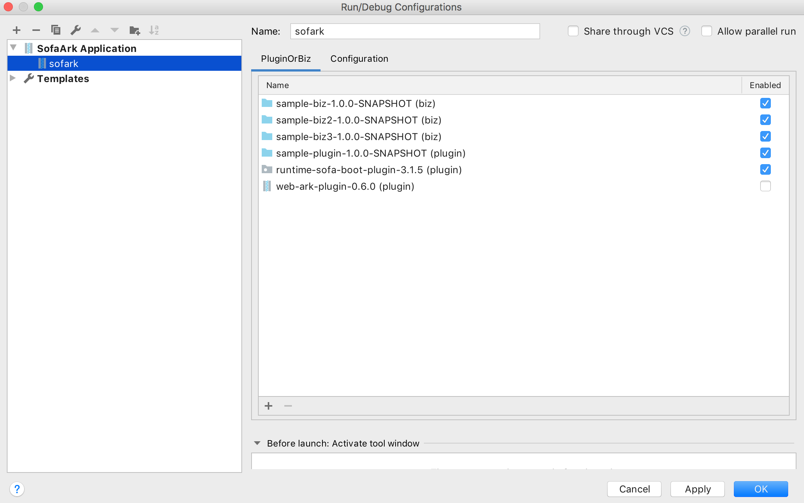

# A Simple Sofa Ark Plugin for Intellij ([中文版](README_CN.md))

## Features
- Import Inspection

According to Sofa Ark rules, this pluign will prompt code problem.

- Multi Modules Run Configuration

If your need, search third part plugin or biz in maven repository.


This pluign will search your expected modules and their dependencies, then add them to run configuration.


## Run Environment
- MacOS High Sierra 10.13.6
- Windows 7
- Java 8+
- Intellij 2019.2+
- Sofa Ark 0.6.0+

## Samples
* [Sofa Ark Samples](https://github.com/ggndnn/sofa-ark-samples) - Sofa Ark Samples for this Plugin

## Developing
* Please refer to [Intellij SDK Doc](http://www.jetbrains.org/intellij/sdk/docs/basics/getting_started.html).
* Please use JDK 1.8_111+
* This project is created using gradle，based on local installed idea (2019.2+).
```
intellij {
    localPath '/Applications/IntelliJ IDEA CE.app'

    plugins 'maven', 'java'
}
```