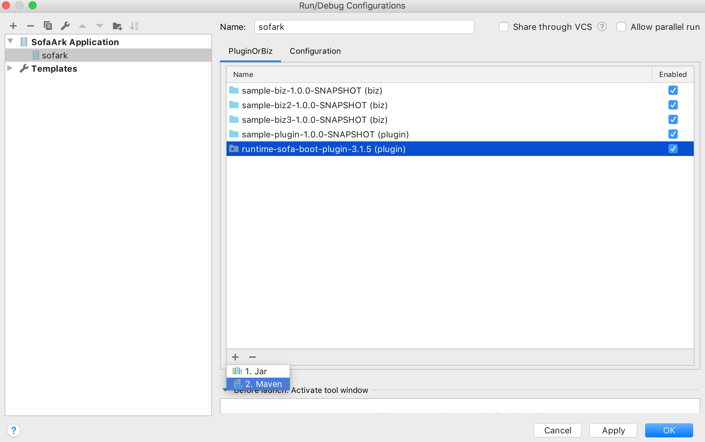
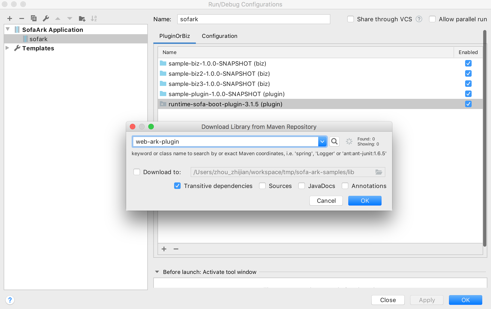

# 一个简单的 Sofa Ark Intellij 插件

## 支持的特性
- 模块导入类检查

根据Sofa Ark的规则如果不允许导入的类出现在代码中，则插件会提示错误

- 多模块启动

缺少模块，通过本地或Maven仓库查找


插件会自动查找所添加模块的依赖，将其中包含的Plugin或者Biz添加到运行配置中

- 支持版本1.1.0以上的Sofa Ark容器

## 运行环境
- MacOS High Sierra 10.13.6
- Windows 7
- Java 8+
- Intellij 2019.2+

## 示例
* [用于验证此插件的示例(Sofa Ark 0.6.0)](https://github.com/ggndnn/sofa-ark-samples/tree/ark_0_6_0)
* [用于验证此插件的示例(Sofa Ark 1.0.0)](https://github.com/ggndnn/sofa-ark-samples)

## 开发环境搭建
* 请参考[官方插件开发指南](http://www.jetbrains.org/intellij/sdk/docs/basics/getting_started.html)了解Idea插件开发
* 请使用JDK1.8_111以上版本
* 本工程使用Gradle方式开发插件，基于本地安装的Idea实例 (2019.2以上版本)
```
intellij {
    localPath '/Applications/IntelliJ IDEA CE.app'

    plugins 'maven', 'java'
}
```
* 请根据具体开发环境修改localPath配置